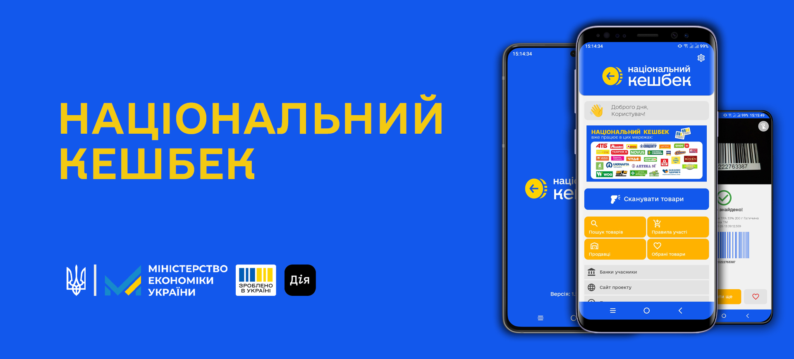

## :bangbang: **Не офіційний Android-застосунок**

   -%23568203?style=flat&logo=android&labelColor=black) -darkgreen?style=flat&logo=android&labelColor=black) 

 

Додаток створено задля спрощення пошуку та визначення товарів та точок продажу, які беруть участь у програмі Національний Кешбек від Міністерства Економіки України.

Рееструетесь, шукаете товари за назвою або штрихкодом та місця, де можна їх придбати, додаєте в обране та ділитеся з іншими власними списками товарів - отже підтримуєте Українських виобників та бізнес.

#### Про державну програму можна [дізнатися тут](.github/cashback.md)

 

### 🏷 Версія 1.5.1
- ✅ Додано віджет "Швидкого доступу"
- ✅ Додано швидкі посилання
- ✏️ Оптимізація та виправлення помилок

 

- **Середовище розробки**: *Android Studio 2024.1.0 (Build AI-241.19072.14.2412.12360217)*
- **Створення та керування SQLite базами:** *DB Browser for SQLite*
- **Збірка застосунку:** *Gradle 8.10.2*

 

1. Встановіть **Git** програму за [інструкцією](), та впевніться, щр шлях до неї записано у змінних оточення
2. Скопіюйте проект з репозиторію на свій пристрій
    - Для цього відкрийте термінал або командний рядок, перейдіть до бажаної дерикторії, та виконайте команду 'git clone https://github.com/GORAlexComp/Cashback-Android.git'
    - Буде створено папку **Cashback-Android**
3. Для роботи з проектом використовується **Google Firebase**. ❗️**Він є обов'язковим та невід'ємним для проекту**
    - Створення **Firebase**
    - Додавання **google-services.json**
4. Для внесення змін у проект та його збір необхідно встановити програму **Android Studio**
    - Відкрийте **Android Studio**, та відкрийте папку **Cashback-Android** (**❗️ не імпортуйте, а відкрийте як вже існуючий**)
5. Внесіть бажані зміни, протестуйте застосунок на своєму пристрої та зберіть його за допомогою Gradle

 

> [!WARNING]
> **Не росповсюджуйте власноруч створені проекти**
> 
> **Повідомляйте про свої зміни за допомогою *Pull Requests*, та ми їх додамо до офіційного застосунку**

 
 

@ 2024 | <a href="https://github.com/GORAlexComp/Cashback-Android/blob/main/SECURITY.md">Політика конфіденційності</a>

 

<!-- Іконки для оформлення -->
<!-- ✏️ ❌ ✅ -->
